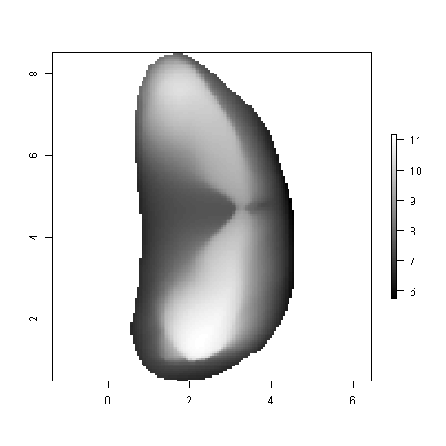
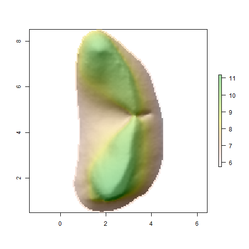
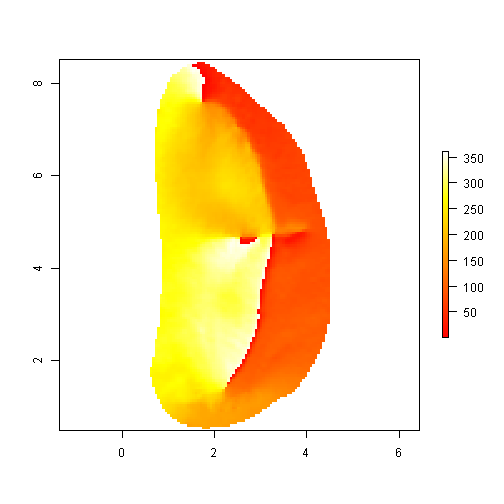
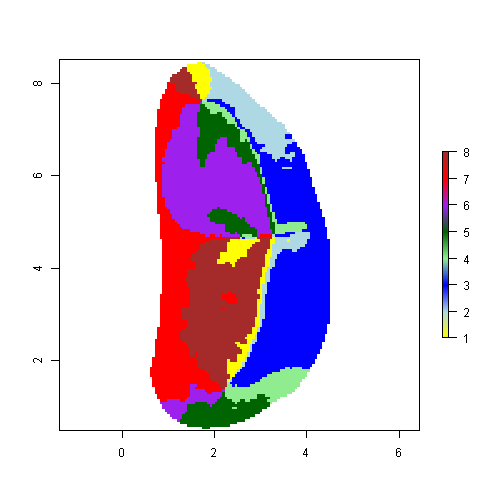
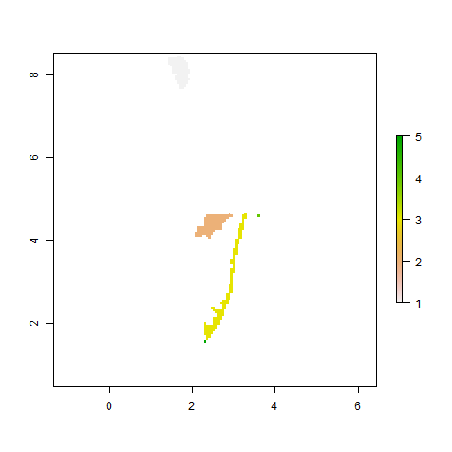
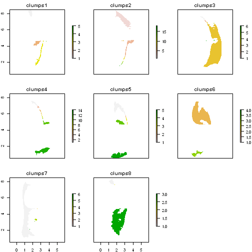

OPC in R GIS
========================================================

These R scripts use GIS packages in R to calculate morphological complexity measure OPC from raster grid text files.

Initialise R:


```r
require(raster)
```

```
## Loading required package: raster
```

```
## Warning: package 'raster' was built under R version 2.15.3
```

```
## Loading required package: sp
```

```
## Warning: package 'sp' was built under R version 2.15.3
```

```r
require(igraph)
```

```
## Loading required package: igraph
```

```
## Warning: package 'igraph' was built under R version 2.15.3
```

```
## Attaching package: 'igraph'
```

```
## The following object(s) are masked from 'package:raster':
## 
## edge
```


GIS in R
-------------------------

Define filename and read file into matrix. Convert matrix into raster object using `rasterFromXYZ()` function. Add projection method for raster object, as this is required for hillShade plot (just keep this default).


```r
setwd("E:/Google Drive/Work desktop/0Current work/R/CatsMiceOPCDataset")  #desktop
# setwd('C:/Users/arevans/Google Drive/Work desktop/0Current
# work/R/CatsMiceOPCDataset') #laptop
Filename <- "Felis_silvestris-1.780-uw_lrm1bemnewor150b.dat"
InputG <- read.table(Filename, header = FALSE, sep = ",", na.strings = "NA", 
    dec = ".", strip.white = TRUE)
RasterG <- rasterFromXYZ(InputG)
projection(RasterG) <- "+proj=eqc +lat_ts=0"
```


Create some initial plots of the raster object.


```r
plot(x = RasterG, col = grey(0:100/100))
```

 

```r
plot(x = RasterG, col = terrain.colors(255))
```

 


Calculate slope and aspect maps using `terrain` function. Use these maps to create a hillShade object, then plot it and overlay it with a topographic map. 


```r
RasterS <- terrain(RasterG, opt = "slope")
RasterA <- terrain(RasterG, opt = "aspect")
RasterH <- hillShade(RasterS, RasterA, 35, 335)
plot(RasterH, col = grey(0:100/100), legend = FALSE)
plot(RasterG, col = rev(terrain.colors(255, alpha = 0.35)), add = TRUE)
```

 


Dental Complexity
=====================

Reclassify this aspect map using the `reclassify` function so that orientations from 0 to 22.5º and 337.5 to 360º are 1 (north), 22.5 to 67.5º are 2(north-east), etc. The function `Define_rcl` creates the reclassification matrix for `NoCat` categories (default = 8) needed as input for the `reclassify` function. 


```r
Define_rcl <- function(NoCat = 8) {
    rcl <- matrix(nrow = NoCat + 1, ncol = 3)
    CatSize <- 360/NoCat
    rcl[, 1] <- c(0, seq(from = CatSize/2, to = 360 - (CatSize/2), by = CatSize))
    rcl[, 2] <- c(seq(from = CatSize/2, to = 360 - (CatSize/2), by = CatSize), 
        360)
    rcl[, 3] <- c(1:NoCat, 1)
    result <- rcl
}

rcl <- Define_rcl(8)
rcl
```

```
##        [,1]  [,2] [,3]
##  [1,]   0.0  22.5    1
##  [2,]  22.5  67.5    2
##  [3,]  67.5 112.5    3
##  [4,] 112.5 157.5    4
##  [5,] 157.5 202.5    5
##  [6,] 202.5 247.5    6
##  [7,] 247.5 292.5    7
##  [8,] 292.5 337.5    8
##  [9,] 337.5 360.0    1
```


Create raster `RasterAD` that shows aspect of surface in degrees, then reclassify it based on `rcl` matrix. Plot the aspect degrees and reclassified aspect maps.


```r
RasterAD <- terrain(RasterG, opt = "aspect", unit = "degrees")

plot(RasterAD, col = heat.colors(255))
```

 

```r

RasterADC <- reclassify(RasterAD, rcl)

aspect.colors <- colorRampPalette(c("yellow", "lightblue", "blue", "lightgreen", 
    "darkgreen", "purple", "red", "brown"), space = "rgb")
plot(RasterADC, col = aspect.colors(255))
```

 


The aspect map of each direction (e.g. north) can be clumped to show all discrete patches of surface that face the same direction. The `freq` function shows the size (in pixels) of each discrete patch for that direction.


```r
RasterC1 <- clump(RasterADC == 1, directions = 4, gaps = FALSE)
plot(RasterC1)
```

 

```r
freq(RasterC1)
```

```
##      value count
## [1,]     1    90
## [2,]     2    95
## [3,]     3   130
## [4,]     4     1
## [5,]     5     1
## [6,]    NA 10709
```


The `ClumpAspect` function calculates the clump map for all `NoCat` directions and creates a raster stack as output.


```r
ClumpAspect <- function(RasterADC, NoCat) {
    result <- 0
    for (i in 1:NoCat) {
        RasterClump <- clump(RasterADC == i, directions = 4, gaps = FALSE)
        
        if (i == 1) {
            RasterClumpStack <- RasterClump
        } else {
            RasterClumpStack <- stack(RasterClumpStack, RasterClump)
        }
    }
    names(RasterClumpStack) <- c(paste(rep("clumps", NoCat), 1:NoCat, sep = ""))
    result <- RasterClumpStack
}

NoCat <- 8
RasterC <- ClumpAspect(RasterADC, NoCat)
plot(RasterC)
```

 


The `CompileClumpData` function calculates the sizes of all clumps for the stack of clump raster maps and outputs a data frame with all of the raw values.


```r
# Must modify to allow for NoCat != 8
CompileClumpData <- function(ClumpsOutput) {
    result <- 0
    ClumpsFreq <- freq(ClumpsOutput)
    NoCat <- length(ClumpsFreq)
    
    temp1 <- as.data.frame(ClumpsFreq$clumps1)
    temp1$Cat <- rep(1, length(temp1$value))
    temp2 <- as.data.frame(ClumpsFreq$clumps2)
    temp2$Cat <- rep(2, length(temp2$value))
    temp3 <- as.data.frame(ClumpsFreq$clumps3)
    temp3$Cat <- rep(3, length(temp3$value))
    temp4 <- as.data.frame(ClumpsFreq$clumps4)
    temp4$Cat <- rep(4, length(temp4$value))
    temp5 <- as.data.frame(ClumpsFreq$clumps5)
    temp5$Cat <- rep(5, length(temp5$value))
    temp6 <- as.data.frame(ClumpsFreq$clumps6)
    temp6$Cat <- rep(6, length(temp6$value))
    temp7 <- as.data.frame(ClumpsFreq$clumps7)
    temp7$Cat <- rep(7, length(temp7$value))
    temp8 <- as.data.frame(ClumpsFreq$clumps8)
    temp8$Cat <- rep(8, length(temp8$value))
    
    tempa <- merge(temp1, temp2, all = TRUE)
    tempa <- merge(tempa, temp3, all = TRUE)
    tempa <- merge(tempa, temp4, all = TRUE)
    tempa <- merge(tempa, temp5, all = TRUE)
    tempa <- merge(tempa, temp6, all = TRUE)
    tempa <- merge(tempa, temp7, all = TRUE)
    tempa <- merge(tempa, temp8, all = TRUE)
    
    result <- tempa
}

ClumpResults <- CompileClumpData(RasterC)
```


The number of aspect clumps, or orientation patch count (OPC) of this map can be calculated. Only patches above a minimum size of `MinClumpSize` are counted.


```r
MinClumpSize <- 2  #Only count clumps larger than MinClumpSize pixels in size
OPCClumps <- subset(ClumpResults, ClumpResults[, 2] > MinClumpSize)
OPCClumps <- na.omit(OPCClumps)
OPC <- nrow(OPCClumps)

OPC
```

```
## [1] 37
```


The summary statistics for patch size are calculated using the `OPCStats` function.


```r
OPCStats <- t(as.matrix(summary(OPCClumps$count)))
OPCStats <- as.data.frame(OPCStats)
OPCStats$SD <- sd(OPCClumps[, 2])
OPCStats <- rbind(c(OPC, OPCStats))
colnames(OPCStats)[1] <- "OPC"

OPCStats
```

```
##      OPC Min. 1st Qu. Median Mean 3rd Qu. Max. SD   
## [1,] 37  3    4       22     221  130     1940 457.6
```


OPC Function
-----------------

The function `OPCCalc` takes a topographic raster map and carries out OPC calculation, outputting OPC statistics.


```r
OPCCalc <- function(RasterG, NoCat = 8, MinClumpSize = 2) {
    RasterAD <- terrain(RasterG, opt = "aspect", unit = "degrees")
    rcl <- Define_rcl(NoCat)
    RasterADC <- reclassify(RasterAD, rcl)
    RasterC <- ClumpAspect(RasterADC, NoCat)
    ClumpResults <- CompileClumpData(RasterC)
    
    OPCClumps <- subset(ClumpResults, ClumpResults[, 2] > MinClumpSize)
    OPCClumps <- na.omit(OPCClumps)
    OPC <- nrow(OPCClumps)
    OPCData <- as.data.frame(OPC)
    
    OPCStats <- t(as.matrix(summary(OPCClumps$count)))
    OPCStats <- as.data.frame(OPCStats)
    OPCStats$SD <- sd(OPCClumps[, 2])
    OPCStats <- merge(OPCData, OPCStats)
    return(OPCStats)
}

OPCCalc(RasterG)
```

```
##   OPC Min. 1st Qu. Median Mean 3rd Qu. Max.    SD
## 1  37    3       4     22  221     130 1940 457.6
```


OPCR Function
--------------

The calculation of morphological complexity can be repeated to take into account differences in orientation of the grid around the vertical z axis, i.e. if the grid were rotated around the vertical axis, the boundaries of the directions would differ. OPCR is the mean of the OPC calculation repeated `NoRot` times. 


```r
Define_rclR <- function(NoCat, NoRot, CurrRot) {
    rcl <- matrix(nrow = NoCat + 1, ncol = 3)
    CatSize <- 360/NoCat
    OffsetSize <- CatSize/NoRot
    Offset <- (CurrRot - 1) * OffsetSize
    
    if (CurrRot <= NoRot/2 + 1) {
        rcl[, 1] <- c(0, seq(from = (CatSize/2) + Offset, to = 360 - (CatSize/2) + 
            Offset, by = CatSize))
        rcl[, 2] <- c(seq(from = (CatSize/2) + Offset, to = 360 - (CatSize/2) + 
            Offset, by = CatSize), 360)
        rcl[, 3] <- c(1:NoCat, 1)
    } else {
        rcl[, 1] <- c(seq(from = Offset - (CatSize/2), to = 360, by = CatSize), 
            0)
        rcl[, 2] <- c(seq(from = (CatSize/2) + Offset, to = 360, by = CatSize), 
            360, Offset - CatSize/2)
        rcl[, 3] <- c(1:NoCat, 8)
    }
    result <- rcl
}

OPCRCalc <- function(RasterGrid, NoCat = 8, MinClumpSize = 2, NoRot = 8, Plot = FALSE) {
    RasterAspectDeg <- terrain(RasterGrid, opt = "aspect", unit = "degrees")
    
    Rots <- c(1:NoRot)
    OPCResultsRot <- data.frame(Rots, OPC = NA, Min. = NA, `1st Qu.` = NA, Median = NA, 
        Mean = NA, `3rd Qu.` = NA, Max. = NA, SD = NA)
    
    CatSize <- 360/NoCat
    
    for (i in 1:NoRot) {
        rclR <- Define_rclR(NoCat, NoRot, i)
        RasterAspectDegClass <- reclassify(RasterAspectDeg, rclR)
        if (Plot == TRUE) {
            plot(RasterAspectDegClass)
        }
        RasterClumped <- ClumpAspect(RasterAspectDegClass, NoCat)
        
        ClumpResults <- CompileClumpData(RasterClumped)
        
        OPCClumps <- subset(ClumpResults, ClumpResults[, 2] > MinClumpSize)
        OPCClumps <- na.omit(OPCClumps)
        OPC <- nrow(OPCClumps)
        OPCData <- as.data.frame(OPC)
        
        OPCStats <- t(as.matrix(summary(OPCClumps$count)))
        OPCStats <- as.data.frame(OPCStats)
        OPCStats$SD <- sd(OPCClumps[, 2])
        OPCStats <- merge(OPCData, OPCStats)
        
        OPCResultsRot[i, 1] <- i
        OPCResultsRot[i, 2:9] <- OPCStats
        
    }
    OPCRStats <- apply(OPCResultsRot, 2, mean)
    OPCRStats <- OPCRStats[2:9]
    return(OPCRStats)
}

OPCRCalc(RasterG)
```

```
##      OPC     Min. X1st.Qu.   Median     Mean X3rd.Qu.     Max.       SD 
##   44.625    3.000    4.531   14.000  184.375  121.375 1747.500  392.702 
```


OPCR for All Files in Directory
----------------------------

The OPCR procedure can be carried out for all files in the current working directory. The results will be compiled into a dataframe.


```r
setwd("C:/Users/arevans/Google Drive/Work desktop/0Current work/R/CatsMiceOPCDataset")  #laptop
```

```
## Error: cannot change working directory
```

```r
RunOPCRDir <- function(NoCat = 8, MinClumpSize = 2, NoRot = 8, MaxFiles = 0, 
    Plot = FALSE) {
    Filenames <- list.files(pattern = "\\.dat$")
    if (MaxFiles == 0) {
        NoFiles <- length(Filenames)
    } else {
        NoFiles <- MaxFiles
    }
    OPCRResultsFiles <- data.frame(Filenames, OPCR = NA, Min. = NA, `1st Qu.` = NA, 
        Median = NA, Mean = NA, `3rd Qu.` = NA, Max. = NA, SD = NA)
    result <- 0
    for (i in 1:NoFiles) {
        InputGrid <- read.table(Filenames[i], header = FALSE, sep = ",", na.strings = "NA", 
            dec = ".", strip.white = TRUE)
        RasterGrid <- rasterFromXYZ(InputGrid)
        projection(RasterGrid) <- "+proj=eqc +lat_ts=0"
        
        OPCRStats <- OPCRCalc(RasterGrid, Plot = Plot)
        
        OPCRResultsFiles[i, 2:9] <- OPCRStats
    }
    
    result <- OPCRResultsFiles
}

OPCRResults <- RunOPCRDir(MaxFiles = 4)
```

```
## Error: arguments imply differing number of rows: 0, 1
```

```r
OPCRResults <- na.omit(OPCRResults)
```

```
## Error: object 'OPCRResults' not found
```

```r

OPCRResults
```

```
## Error: object 'OPCRResults' not found
```

